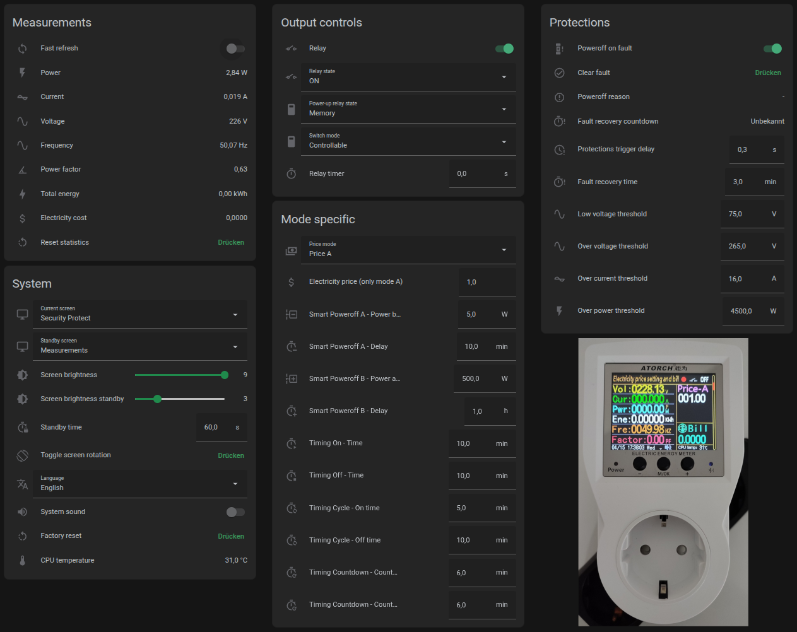
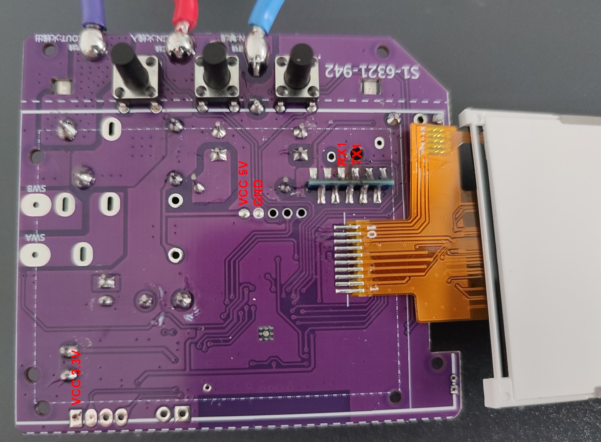
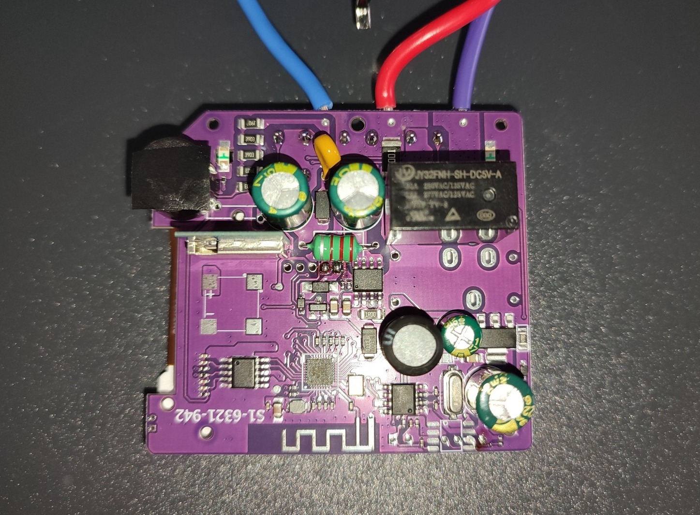
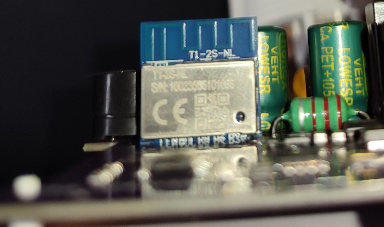

# Atoch S1BWP ESPHome

An ESPHome script that frees your S1BWP power meter from the Tuya cloud and enables fully local control via Home Assistant.

> [!NOTE]
> This project is primarily aimed at the new S1BW(P) versions that are based on the AC6321A microcontroller and T1-2S-NL WiFi module. Other S1 variants with WiFi support may or may not work.


*The dashboard YAML can be found in [ha-dashboard.yaml](ha-dashboard.yaml).*

## Install
### 1. Install ESPHome and configure project
Support for the BK7238 in libretiny is still experimental and currently only works in ESPHome 2026.02.04 or earlier, see PR [#360](https://github.com/libretiny-eu/libretiny/pull/360).

```sh
# Install esphome
pip3 install esphome==2026.02.04

# Clone this external component
git clone https://github.com/1RandomDev/atorch-s1bwp-esphome.git
cd atorch-s1bwp-esphome

# Copy example config
cp secrets.yaml.sample secrets.yaml

# Validate configuration and compile
esphome compile atorch-s1bwp-esphome.yaml
```

### 2. Connect to the WiFi module
> [!CAUTION]
> Do not connect the device to the mains while hooked up to a computer, everything on the low voltage side is live!

Connect a USB to serial adapter to RX1/TX1 (the existing connections to the devices PCB need to be broken) and power the device either via 5v or 3.3v. See [Board Images](#board-images) for reference.

### 3. Backup the original firmware
This backup is needed if you ever want to install firmware updates for the primary MCU, which are currently only available through the SmartLife app.

The flash contents of the BK7238 can be read using [ltchiptool](https://github.com/libretiny-eu/ltchiptool) or [BK7231GUIFlashTool](https://github.com/openshwprojects/BK7231GUIFlashTool). After the backup process is completed, do NOT reset or power cycle the device. If the device is left in programming mode the next step will be a lot easier.

### 4. Flash ESPHome via UART
```sh
esphome run atorch-s1bwp-esphome.yaml
```

## Board Images




## Available Tuya data points
The following Tuya data points were identified using [TuyaMCUAnalyzer](https://github.com/openshwprojects/TuyaMCUAnalyzer).

| DP&nbsp;Id | Type | Description | Unit/Range | Prescaler | Writable |
| ----- | ---- | ----------- | ---------- | --------- | -------- |
| 1 | Boolean | Actual relay state | | | |
| 9 | Integer | Countdown until relay toggle (cannot be used in mode AUTO) | 0-360000 s | | X |
| 18 | Integer | Current | A | * 0.001 | |
| 19 | Integer | Power | W | * 0.01 | |
| 20 | Integer | Voltage | V | * 0.01 | |
| 101 | Integer | Electricity price (only price mode A) | 0-999.99 | * 0.01 | X |
| 102 | Integer | Calculated electricity cost | | * 0.0001 | |
| 103 | Integer | Protections trigger delay | 0-2 s | * 0.1 | X |
| 104 | Integer | Over voltage protect threshold | 0.1-275 V | * 0.1 | X |
| 105 | Integer | Over current protect threshold | 0.01-20 A | * 0.01 | X |
| 106 | Integer | Over power protect threshold | 1-4500 W | | X |
| 107 | Enum | Language | 0=Chinese<br>1=English | | X |
| 108 | Integer | Screen brightness | 1-9 | | X |
| 109 | Integer | Screen brightness standby | 1-9 | | X |
| 110 | Integer | Standby time | 3-99 s | | X |
| 111 | Boolean | Key beep | | | X |
| 112 | Enum | Switch mode | 0=Controllable<br>1=Normally on | | X |
| 113 | Boolean | Clear data (can only be set to true, no feedback) | | | X |
| 114 | Boolean | WiFi reset (can only be set to true, no feedback) | | | X |
| 115 | Boolean | System factory reset (can only be set to true, no feedback) | | | X |
| 116 | Boolean | Toggle screen rotation (can only be set to true, no feedback) | | | X |
| 117 | Enum | Standby screen | 0=Original<br>1=Measurement<br>2=Calendar<br>3=Screen OFF | | X |
| 118 | Enum | Current screen | same order as on device | | X |
| 119 | Integer | Mode: Smart Poweroff A - Power below | 1-999 W | | X |
| 120 | Integer | Mode: Smart Poweroff A - Delay until power off | 1-99 min | | X |
| 121 | Integer | Mode: Smart Poweroff B - Power above | 1-999 W | | X |
| 122 | Integer | Mode: Smart Poweroff B - Delay until power off | 1-99 h | | X |
| 123 | Integer | Energy | kWh | * 0.001 | |
| 124 | Integer | Last set time from multiple modes (use dedicated datapoints instead) | s | | |
| 125 | Integer | Mode: Timing Off - Time | 1-5999 min | / 60 | X |
| 126 | Integer | Mode: Timing On - Time | 1-5999 min | / 60 | X |
| 127 | Integer | Mode: Timing Cycle - On | 1-5999 min | / 60 | X |
| 128 | Integer | Mode: Timing Cycle - Off | 1-5999 min | / 60 | X |
| 129 | Integer | Mode: Timing Countdown - Countdown On | 1-5999 min | / 60 | X |
| 130 | Integer | Mode: Timing Countdown - Countdown Off | 1-5999 min | / 60 | X |
| 131 | Enum | Selected relay state | 0=ON<br>1=OFF<br>2=AUTO | | X |
| 132 | Enum | Poweroff reason/fault (set to 0 to clear) | 0=none<br>1=over voltage<br>2=over current<br>3=over power<br>4=smart poweroff A<br>5=smart poweroff B<br>6=*unknown*<br>7=timing off<br>8=*unknown*<br>9=*unknown*<br>10=low voltage | | X |
| 133 | Integer | Frequency | Hz | * 0.01 | |
| 134 | Integer | Power factor | | * 0.01 | |
| 135 | Integer | CPU temperature | °C | | |
| 136 | Enum | Price mode | 0=Price A<br>1=Price B<br>2=Price C | | X |
| 137 | Integer | Fault recovery time | 1-99 min | | X |
| 138 | Enum | Power-up relay state | 0=ON<br>1=OFF<br>2=Memory | | X |
| 139 | Boolean | Poweroff relay on fault | | | X |
| 140 | Boolean | Fast refresh measurements (turns itself off automatically after 5min) | true=every 1s<br>false=every 5min | | X |
| 141 | Integer | Low voltage protect threshold | 0.1-275 V | * 0.1 | X |
| 142 | Integer | Fault recovery countdown | s | | |
